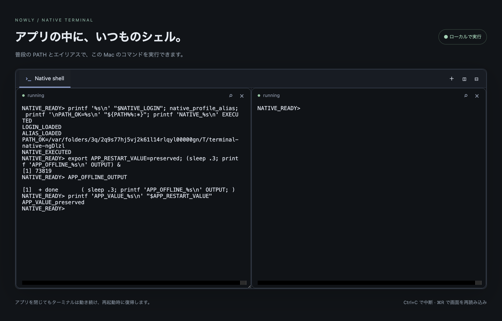
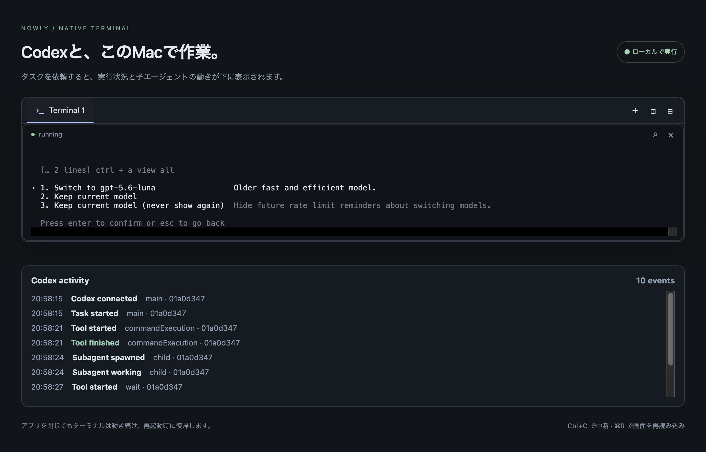

# Verification — 2026-09-24

Environment: macOS arm64. All checks below were run locally on the final source changes.

- `pnpm check`: TypeScript and build pass; 14 tests across host, transport, restoration and shell profile pass.
- `pnpm test:e2e`: two Chromium journeys pass against real node-pty shells: shell input, search controls, tab creation/switching, split/close, reload, reconnect preserving PID, resize; three panes remain within the workspace and can all be closed.
- `pnpm exec vite build --config examples/react/vite.config.ts`: demo production bundle builds. xterm makes the bundle exceed Vite's default 500 kB warning threshold; this is a size warning, not a build failure.
- `pnpm pack`: package includes separated browser/client/React/server exports, declarations, CSS, notices, integration documentation and native helper postinstall.
- Installed final tarball into a new canonical temporary directory using npm, with no Orca source imports. Actual packaged server/client shell round trip passes; CSS resolves. A separate React app importing only package exports builds with Vite.
- Fresh consumer `npm audit --omit=dev`: 0 vulnerabilities after updating ws to 8.21.3. An earlier reused temp directory retained stale lock entries; the fresh consumer is the final dependency evidence.

Read-only independent review identified incomplete cursor/charset restoration, queued mutations after rejection, and third-pane clipping. All three were reproduced and fixed. Regression cases cover scroll-region cursor position, saved cursor position, DEC line drawing, rejected-frame burst fencing, and three split panes. Binary mouse input additionally preserves byte 0x80 in a real PTY test.

Limits: Linux/Windows and Electron packaged runtime have not been executed here. The demo E2E uses the real default shell with its clean profile to avoid dependencies on personal startup plugins. Host restart persistence, full Orca native daemon recovery, saved SGR/charset register fidelity, and exhaustive TUI protocol compatibility are not claimed. Clipboard requests are limited to 64 KiB UTF-16 code units per write and wire frames to 128 KiB. Disk persistence, SSH management and image protocols remain outside this version.

## Local command follow-up

The user's actual demo showed an empty terminal while user shell initialization ran external tools. The default demo now skips optional startup profiles, preserves inherited PATH, and starts UI + PTY host using one `pnpm dev`. The library retains user-profile behavior by default and exposes the opt-in `shellProfile` setting.

A failing regression test first reproduced `.zshrc` delaying the prompt; with clean startup it passes and executes local `node` and `pwd`. All 14 tests and both Chromium journeys pass. The updated in-app browser was reloaded and `pwd; node --version; printf "LOCAL_COMMAND_OK\\n"` was typed through the terminal UI: output showed the nowly-terminal directory, Node v26.3.1 and LOCAL_COMMAND_OK. The demo remains running on port 5186.

## Distribution package 0.1.1

`@nowly/terminal@0.1.1` includes the `nowly-terminal serve` CLI, browser/React/server entry points, CSS and declarations. `prepack` rebuilds from a clean dist directory. Source checkout demos and tests are excluded from the archive.

- `pnpm check`: 17 tests pass; typecheck and clean build pass.
- `pnpm test:package`: automatic pack/build, isolated installation, packaged CLI startup, real local Node command through WebSocket/PTY, graceful shutdown, strict consumer TypeScript validation, and React/CSS production build all pass.
- CLI auth comes from `TERMINAL_TOKEN`; no token is printed. Invalid ports, origins, profile names, unknown and missing options are covered by tests.
- Artifact: `nowly-terminal-0.1.1.tgz`. npm registry publication was not performed.

## Shell initialization and native sample — 0.1.2

This revision supersedes the earlier clean-default workaround: library, CLI, browser demo and native sample now use the normal user profile. Supported POSIX shells start with `-il`; `.zprofile` PATH and `.zshrc` aliases are verified together. Clean mode is explicit only (`pnpm dev:clean` / `--profile clean`). User dotfiles are untouched.

- `pnpm check`: 18 tests, typecheck and build pass.
- `pnpm native:setup`: installs the actual 0.1.2 tarball into an isolated npm project, rebuilds node-pty for Electron 43.7.0, and builds the renderer successfully.
- `pnpm test:native`: hidden macOS arm64 Electron window passes login PATH/alias initialization, real keyboard command execution, renderer isolation, invalid IPC rejection, split, reload with the same PID/output, pane close and PTY exit after app quit.
- The native renderer uses fixed-channel preload IPC, not a WebSocket server. Main validates sender/top frame/file URL and owns lifecycle. The example imports package exports only.

This is a runnable Electron source example, not a signed application installer. Linux/Windows native execution remains unverified.

Final regression checks for 0.1.2:

- 19 host/transport/startup tests pass, including cursor-position query replies before a renderer attaches; attached views retain live query ownership.
- Independent review findings reproduced before fixes: stale tarball integrity on fresh-cache installation, unsupported Electron `window.prompt` rename, and initialization failure incorrectly exiting successfully. All fixed with regression coverage.
- `pnpm test:native-package` passes: packs, checks exact tarball integrity, installs with a fresh npm cache in a separate directory, rebuilds native dependencies, builds React, and runs both native tests. Rename, isolation, shell startup, restore, process shutdown and failure guidance are covered.
- `pnpm test:package` passes for the packaged CLI, actual local command and independent TypeScript/React consumer. Registry publication was not performed.

Actual user-profile smoke also passes in hidden Electron: normal `.zshrc` startup completes, a local command executes, and zsh reports login/interactive options enabled. An old pyenv rehash lock was preventing normal startup; all remaining rehash processes were newer than the lock and no process had it open. The stale lock was moved to `~/.pyenv/.nowly-terminal-backups/.pyenv-shim-20260924-195722`. No shell configuration files were changed.

Implementation decisions and rollback notes:

- Kept the existing isolated `nowly-terminal` repository/branch at the user-requested sibling location. No new worktree was needed; another isolated checkout can be created if further concurrent work needs it.
- Used the installed Playwright Electron support for hidden-window UI validation instead of installing another browser driver. Manual native validation can be repeated if a platform-specific interaction differs.
- Replied to startup terminal queries in the host only before any view is attached, since consumed queries cannot be recovered from a snapshot. Attached views continue to answer live queries; this routing is isolated in Session if later embedding requirements differ.
- Retired only the verified stale pyenv runtime lock, preserving a backup at the path above. To undo, stop rehash processes first and restore that backup; no `.zshrc` or other shell configuration was edited.

All final review findings were fixed. No deferred review findings. Work remains on the local `codex/terminal-toolkit` branch.

## Persistent native daemon — 0.1.3

Native architecture is now renderer → preload IPC → Electron main → authenticated local socket → detached daemon → PTY. This supersedes the 0.1.2 sample's main-process host and quit-time shell termination. Ordinary quit preserves sessions; explicit Stop terminals shuts them down.

- Real-process daemon tests: detach/reconnect preserves PID, variables and offline output; concurrent launches reuse one daemon; configuration mismatch is rejected; wrong tokens/malformed frames cannot create sessions; dead daemon replacement and stale launch-lock refusal work.
- Hidden Electron restart test passes: close the application, verify shell/daemon still alive, relaunch with the same userData, recover the same PID/layout/variables/output, and execute another command. Existing profile, isolation, rename, split and reload checks remain.
- No new runtime dependencies. Daemon client does not load node-pty in Electron main. Native child uses matching Electron Node mode.

The daemon is deliberately not an OS service and does not resurrect shells after daemon/OS death. Windows/Linux execution is not claimed. A crashed launcher's uncertain startup lock requires verified manual recovery rather than blind deletion.

Final verification after the independent review fixes:

- TypeScript and clean library build pass; 25 host/transport/daemon tests pass.
- Both browser journeys pass. The packaged CLI executes a real local command, and the isolated TypeScript/React consumer builds successfully.
- Standalone native archive passes fresh-cache installation, native rebuild, renderer build and both Electron tests on macOS arm64. The screenshot above now shows the recovered session after a full application restart.
- The review reproduced two defects before correction: the Electron bootstrap environment flag leaked into interactive shells, and a shell ignoring SIGHUP survived explicit shutdown. The daemon now clears the bootstrap flag before creating its host; session disposal waits for exit and escalates to SIGKILL after a bounded grace period. Shutdown errors remain visible and retryable. Both regressions pass, including shell termination before shutdown acknowledges success.
- No deferred review findings. Version 0.1.3 library/native archives were rebuilt. Work stays on the local codex/terminal-toolkit branch; no new push or registry publication was performed.

## Codex terminal lifecycle capture — 0.2.0

Native sample now launches the real Codex TUI. An optional trusted host profile starts a dedicated app-server, owned alongside the PTY by the resident daemon, and observes its structured notifications through a transparent private Unix WebSocket-to-stdio proxy. Standard interactive approvals stay in Codex. Browser mode remains opt-in. Direct TerminalHost.create is now asynchronous; transport methods are unchanged.

Implementation decisions backed by actual CLI0.155.1 probes:

- Empty pre-created threads cannot be resumed reliably: two RPC clients and the TUI reproduce no-rollout-found even while the thread is loaded. Letting the TUI create the thread resolves this without a synthetic initial task.
- User shell initialization emits terminal control sequences. These corrupted JSON stdout until shell initialization output was redirected to stderr and only app-server stdout restored to the protocol pipe. A failing control-sequence fixture now passes.
- Actual plugin/list responses exceed8MiB; backend frames now have a64MiB bound and incremental chunk collection. A9MiB legitimate response and65MiB rejection are tested.
- Late child completion deduplicates against an already observed collaboration wait result. Backend death closes the TUI connection. Concurrent shell creation no longer double-counts pending capacity. Each was reproduced before correction.

The actual read-only smoke read numbers.txt, delegated one addition to a child, waited for it and completed. The metadata-only recording is [codex-events.json](evidence/codex-events.json). It contains root task start/completion, child spawn/start/completion and tool start/completion. The real native UI smoke also received parent and child completion and restored the events after reload. Authentication/model came from the existing local Codex installation; no user config or hook trust was modified.

The test uses task completion events as the authority, not the PTY process exit or a word appearing in screen output. Activity history is bounded to200 events per terminal and is not a durable delivery guarantee. Codex process or OS death does not resurrect a running task. Codex mode is POSIX-only, with macOS arm64 execution verified.

Final review and environment findings:

- Independent review reproduced two issues: capture stopped after a second TUI root, and collaboration completion could bypass the 128-thread ownership bound. Regression tests failed before correction. Root changes now preserve event sequence/history; fallback only emits for tracked children with known parents, and capacity eviction removes an ownership subtree together.
- The first real run after root-switch support exposed Codex child/internal work being misclassified as user tasks. Root registration now correlates the TUI's own thread/start, thread/resume or thread/fork request with its successful response; a protocol fixture reproduces and guards against false task completion.
- macOS `/bin/sh -il` in this environment closes inherited protocol descriptors (isolated descriptor probe reproduces Bad file descriptor); zsh user initialization and controlled bash initialization are supported. Delegated judgment retained the stdio proxy and changed the deterministic native fixture to an isolated zsh profile. Cost: Codex mode does not support sh/custom startup that closes those descriptors. Shell-only behavior is unchanged.
- Execution stayed on the existing sibling repository and branch to preserve local work. Cost if isolation is needed later: create a separate checkout. The private Unix transport uses WebSocket framing without a TCP port; the transparent proxy lets the TUI own initialization and approvals. Cost: future experimental Codex protocol changes may require adapting this profile.

Codex TUI also creates a temporary thread with threadSource=system to generate a title. A metadata-only request trace confirmed this. System threads are excluded even when requested by the TUI; only user thread lifecycle is projected. The matching regression failed before the filter and now guards the completion boundary.

Final checks on 2026-09-24:

- TypeScript and clean build pass; 45 unit/integration tests pass. Root switching, user/system request separation, descendant identity, bounds, shell startup output and process shutdown have regression coverage.
- Both browser journeys and the isolated package consumer (CLI/local command plus TypeScript/React build) pass.
- The standalone native archive passes fresh-cache install, native rebuild and all four Electron tests, including the real read-only Codex task and child completion followed by reload/replay (19.5 seconds for the live test). The screenshot shows completion events; the terminal also displays Codex's account usage reminder. No model/usage settings were changed.
- The final standalone Codex smoke passes with the actual result CODEX_CAPTURE_OK 42 and only the user root in task events. The updated metadata recording is docs/evidence/codex-events.json.
- Independent review findings are resolved; no deferred findings. Version 0.2.0 library/native archives are rebuilt. Work remains on codex/terminal-toolkit; no new push or registry publication.

## Final assistant replies — 0.2.1

Completion events now carry optional finalMessage and finalMessageTruncated. The reply is isolated by thread/turn, preferring the explicit final-answer phase and falling back to legacy assistant messages. Commentary/reasoning/tool outputs are excluded. A child completion observed through collaboration can carry its reply. The same event, including text, is restored by snapshot replay. Text is capped at 8 KiB UTF-8; Unicode boundaries and leading BOM text are preserved.

- Five new normalization checks initially failed and passed after implementation; a Unicode/BOM preservation regression also failed before correction. Tests cover parent/child/next-turn separation, last final answer selection, legacy phases, missing/incomplete messages, failure/interruption exclusion, replay, child wait results and text bounds.
- The real read-only Codex smoke passed with finalMessage=CODEX_CAPTURE_OK 42 on task.completed and finalMessage=42 on subagent.completed. The updated recording is docs/evidence/codex-events.json.
- Daemon transport/reconnection retains the text. The isolated native archive passed fresh-cache installation, build and three Electron tests, including final reply access through renderer IPC before and after reload. The optional live native model test was not repeated; the actual model was verified by the standalone smoke.
- The bounded design uses existing completion events rather than adding an API; no new permissions or UI are required. The normal 200-event in-memory replay limit applies, and missing replies remain absent rather than fabricated. Existing event consumers remain compatible; the reply field intentionally adds assistant text to the former metadata-only completion event.

Final TypeScript/build checks and all 52 unit/integration tests pass. The local 0.2.1 native sample and both distribution archives were rebuilt after the Unicode correction. Changes remain committed locally; no publication was performed.
