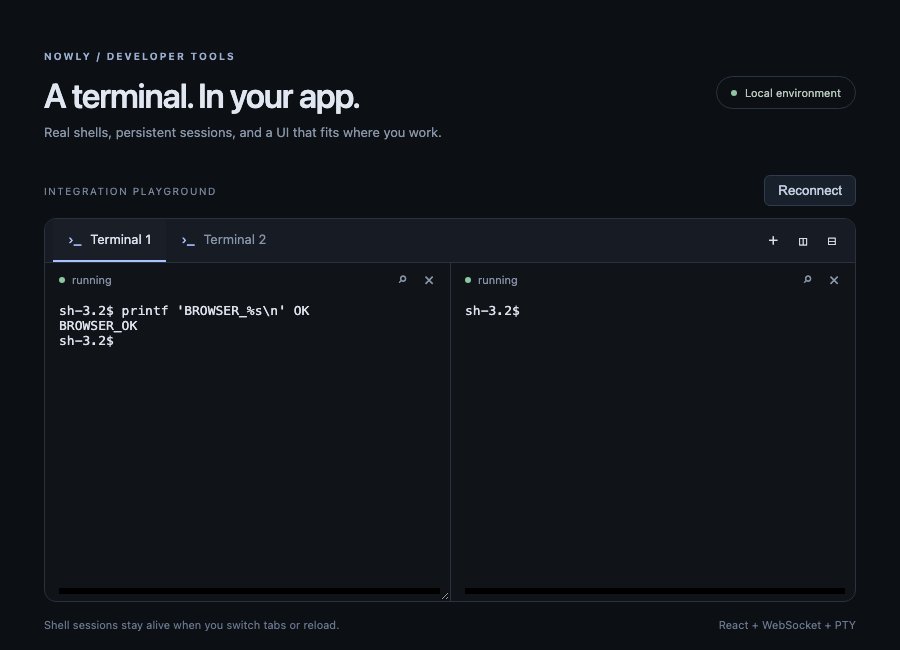

# Verification — 2026-09-24

Environment: macOS arm64. All checks below were run locally on the final source changes.

- `pnpm check`: TypeScript and build pass; 13 tests across host, transport and restoration pass.
- `pnpm test:e2e`: two Chromium journeys pass against real node-pty shells: shell input, search controls, tab creation/switching, split/close, reload, reconnect preserving PID, resize; three panes remain within the workspace and can all be closed.
- `pnpm exec vite build --config examples/react/vite.config.ts`: demo production bundle builds. xterm makes the bundle exceed Vite's default 500 kB warning threshold; this is a size warning, not a build failure.
- `pnpm pack`: package includes separated browser/client/React/server exports, declarations, CSS, notices, integration documentation and native helper postinstall.
- Installed final tarball into a new canonical temporary directory using npm, with no Orca source imports. Actual packaged server/client shell round trip passes; CSS resolves. A separate React app importing only package exports builds with Vite.
- Fresh consumer `npm audit --omit=dev`: 0 vulnerabilities after updating ws to 8.21.3. An earlier reused temp directory retained stale lock entries; the fresh consumer is the final dependency evidence.

Read-only independent review identified incomplete cursor/charset restoration, queued mutations after rejection, and third-pane clipping. All three were reproduced and fixed. Regression cases cover scroll-region cursor position, saved cursor position, DEC line drawing, rejected-frame burst fencing, and three split panes. Binary mouse input additionally preserves byte 0x80 in a real PTY test.

Limits: Linux/Windows and Electron packaged runtime have not been executed here. The demo E2E uses `/bin/sh` to avoid dependencies on the developer's personal shell plugins. Host restart persistence, full Orca native daemon recovery, saved SGR/charset register fidelity, and exhaustive TUI protocol compatibility are not claimed. Clipboard requests are limited to 64 KiB UTF-16 code units per write and wire frames to 128 KiB. Disk persistence, SSH management and image protocols remain outside this version.
